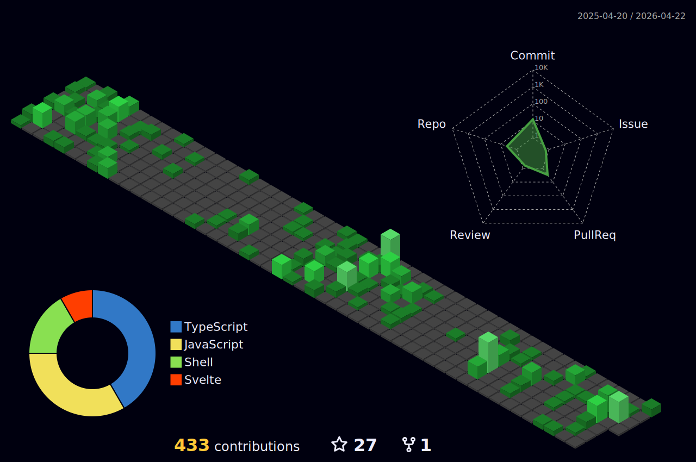

<h1 > Welcome to me profile </h1>

  <b>Web developer</b>

 
 
<ul>
  <li>💻 I am currently doing freelance and working at Ímpar</li>
  <li>⚙ <a href="https://icaro.fun" target="_blanck">Link to my portfolio</a></li>

</ul>

    &emsp;&emsp;&emsp;

  

 

  <h3>Technologies :</h3>

  
    &nbsp;
  
    &nbsp;
  
    &nbsp;
  
   &nbsp;
  
    &nbsp;
  
  &nbsp;
 
  &nbsp;
 
  &nbsp;

   

  <h3>Contacts :</h3>

 
  
  

   
  

     
  

   

  
  
  
  

  

    
Ver as últimas 10 músicas que eu ouvi

    

  
